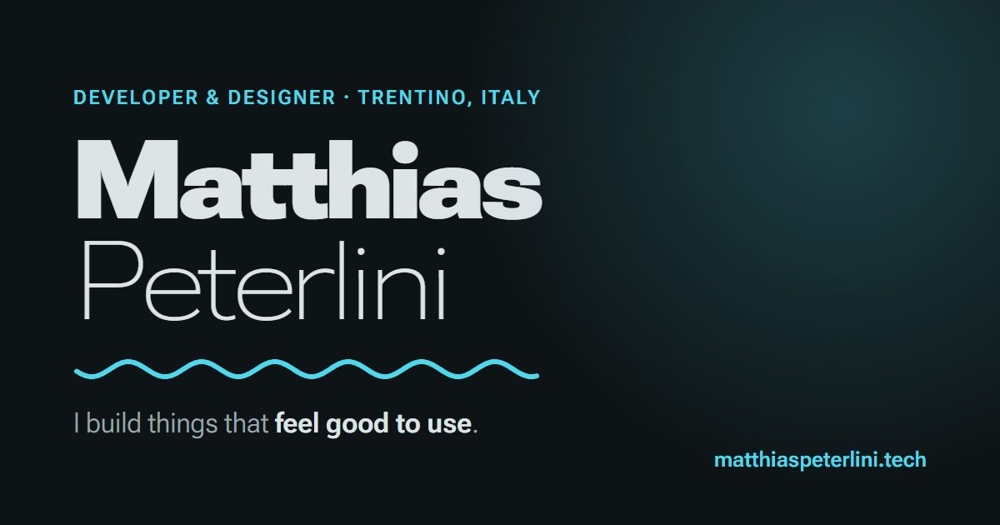

<a href="https://matthiaspeterlini.tech">
  
</a>

<p align="center">
  <a href="https://matthiaspeterlini.tech"><b>matthiaspeterlini.tech</b></a> ·
  <a href="https://matthiaspeterlini.tech/it/">Versione italiana</a>
</p>

<p align="center">
  
  
  
  
</p>

---

My personal site: a single hand-written HTML page served by a Cloudflare Worker. No framework, no bundler, no client-side dependencies, just HTML, CSS and a little JavaScript.

## Highlights

- **Material 3 Expressive look**: spring animations, shape-morphing cards and buttons, and a wavy line under my name drawn on a `<canvas>` that gets livelier while the pointer moves.
- **Variable type**: *Roboto Flex*. The surname morphs between weights and widths on hover, or every two seconds on touch screens.
- **Light and dark**: follows the system theme, with a tonal accent per project card.
- **Live GitHub data**: profile stats, top languages, recently pushed repositories, and the contribution calendar as a **3D city** you can drag to rotate and tap for details (or flip back to the classic 2D grid). Drawn on a plain `<canvas>`, no WebGL or libraries.
- **English and Italian**: visitors in Italy (or with an Italian browser) land on `/it/` automatically. The language switch remembers their choice.
- **Considerate by default**: respects `prefers-reduced-motion`, semantic markup and alt text, JSON-LD profile data, Open Graph cards, `hreflang` and a sitemap.

## How it works

```
                    ┌──────────────────────────── Worker (src/index.js) ───────────────────────────┐
request ──────────▶ │ www.* ─────────────────────────────▶ 301 to the bare domain                  │
                    │ ?lang=en|it ───────────────────────▶ set cookie, 302 to the clean URL        │
                    │ /  + in Italy / Italian browser ───▶ 302 to /it/  (unless cookie says "en")  │
                    │ /api/contributions ────────────────▶ GitHub calendar → JSON, cached 1 h      │
                    │ anything else ─────────────────────▶ static file from public/                │
                    └──────────────────────────────────────────────────────────────────────────────┘
```

GitHub has no public API for the contribution calendar, so the Worker reads the same HTML fragment github.com renders on profiles, turns it into JSON, and caches it at the edge. Profile stats and repositories come straight from the public GitHub REST API in the browser.

## Project structure

```
public/
├── index.html          English page (HTML, CSS and JS in one file)
├── city.js             3D contribution map, shared by both languages
├── it/index.html       Italian page
├── covers/             project screenshots (WebP)
├── og.png              social preview image
├── favicon.svg
├── robots.txt
└── sitemap.xml
src/index.js            the Worker
wrangler.jsonc          Worker config: name, custom domains, static assets
```

## Run it locally

Requires Node.js 22 or newer.

```sh
npm install
npm run dev        # http://localhost:8787
```

To preview the Italian redirect, send an Italian `Accept-Language` header, or open `/?lang=it` (and `/?lang=en` to switch back).

## Deploy

```sh
npx wrangler login     # or set CLOUDFLARE_API_TOKEN
npm run deploy
```

> [!NOTE]
> The two languages are separate files. When you change copy in `public/index.html`, update `public/it/index.html` too.

## Built with

HTML · CSS · vanilla JavaScript · [Cloudflare Workers](https://developers.cloudflare.com/workers/) with [static assets](https://developers.cloudflare.com/workers/static-assets/) · [Roboto Flex](https://fonts.google.com/specimen/Roboto+Flex)

## License

The code is [MIT](LICENSE): feel free to borrow the Worker, the wavy line or anything else. The text, images, project names and logos are mine, so please don't republish them as your own.

## Contact

[matthias.peterlini@gmail.com](mailto:matthias.peterlini@gmail.com) · [GitHub](https://github.com/matthias-peterlini)
